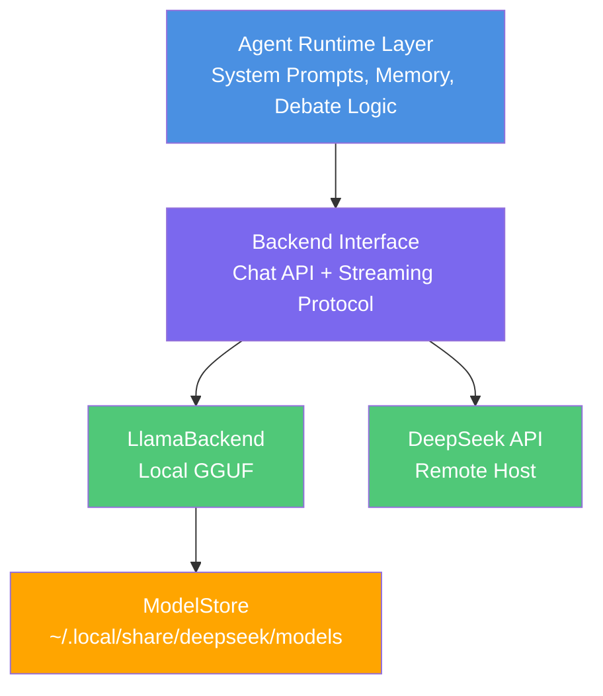

# CppDeepSeek: Building a Local-First Agent Runtime in C++ (with Real Guardrails)

Most agent demos require an API key, break offline, and have no real guardrails. That's fine for a toy, but it fails quickly in real engineering contexts where latency control, reliability guarantees, and enforceable policies matter. The goal was to build a system that could demo **offline**, with **repeatable guardrails**, and a clean architecture that could switch between local inference and a hosted API without rewriting the app.

**CppDeepSeek** is a C++20 agent runtime that defaults to local inference (via llama.cpp + GGUF), supports DeepSeek's hosted API as a fallback, and includes an explicit **Logic Gate** to enforce policy. It runs on Linux/WSL2 with CUDA and Mac with Metal acceleration.

---

## Why C++ for Agent Systems?

Python dominates the AI tooling landscape with frameworks like LangChain and AutoGen. So why build an agent runtime in C++?

**Performance and control.** C++ gives direct access to hardware acceleration (CUDA, Metal), fine-grained memory management, and predictable latency. For production systems where inference speed matters, C++ can be 10-100x faster than Python for the same workload.

**Deployment flexibility.** C++ binaries are self-contained and don't require Python runtime dependencies. This matters for embedded systems, edge deployment, or environments with strict dependency policies.

**First-class local inference.** While Python frameworks bolt on local inference as an afterthought, C++ can treat llama.cpp as a native backend with zero overhead.

This isn't about replacing Python for experimentation—it's about providing a production-grade alternative when systems need to ship.

---

## Architecture Overview



The system has three layers:

- **Agent Runtime**: Agents have system prompts, memory, and debate loops. This layer is backend-agnostic.
- **Backend Interface**: A thin abstraction for chat completion and streaming. Same interface for local and remote.
- **ModelStore**: A shared model cache (`~/.local/share/deepseek/models`) that multiple projects can reference.

The backend abstraction is critical—it allows the same agent code to run against local llama.cpp or remote APIs without modification.

---

## The Core Goals

The design requirements were kept simple and testable:

1. **Local-first by default** (no API key required, works offline).  
2. **Clear policy enforcement** (Logic Gate that can reject inputs).  
3. **Interactive CLI** (natural exploration without command-line complexity).  
4. **Readable demos** (human-paced, streaming output).  
5. **Reusable model cache** across multiple projects.  
6. **Swappable backends** with a stable interface.

If a design didn't support these, it didn't make the cut.

---

## Local Inference (llama.cpp + GGUF)

Local mode is the default. The system expects a GGUF model at:

```
~/.local/share/deepseek/models/deepseek-r1/model.gguf
```

The build script (`./b`) downloads a quantized model automatically if missing (typically 4-8GB depending on quantization level). Setup is frictionless while keeping everything local.

The local backend is implemented via a `LlamaBackend` class that:

- loads the GGUF model  
- tokenizes prompts  
- runs decode steps with hardware acceleration  
- returns plain text output via the same interface as the API client

**Performance characteristics:**
- **Inference speed**: ~20-40 tokens/sec on modern GPUs (RTX 3070+, M1/M2 Mac)
- **Memory**: 8GB GPU VRAM minimum for 7B parameter models
- **Latency**: Sub-100ms first-token for cached prompts

Local inference isn't an afterthought—it's a first-class backend with production-grade performance.

---

## The Logic Gate (Policy as a First-Class Citizen)

This is not safety theater. The Logic Gate is a real **YES/NO** decision point. It has its own prompt, runs before the debate, and can block inputs outright.

In the demo, a "software-engineering-only" gate rejects off-topic prompts. The gate receives the user query and responds with structured output:

```
DECISION: REJECT
REASON: Query about restaurant recommendations is outside 
        software engineering scope
```

This proves that policy enforcement is **built into the flow**, not bolted on afterward.

From an engineering leadership perspective, this is the difference between "interesting demo" and "deployable architecture." Compliance, safety, and domain boundaries become architectural features, not post-processing checks.

---

## Agent Runtime: Interactive CLI + Memory + Streaming

The runtime launches with an interactive CLI by default:

```bash
$ ./build/agents
DeepSeek Agent Runtime
Type a debate topic and press ENTER (or 'quit' to exit):
> Is microservices architecture appropriate for startups?
```

No command-line arguments required. Type a topic, press ENTER, watch the debate unfold.

The runtime includes:

- **System prompts** and **persistent memory** per agent  
- **Configurable debate rounds** (default: 2)  
- **Streamed output** formatted for readability  
- **Human-paced display** with ENTER prompts between responses  
- **Save/load memory** for multi-session continuity

The pacing matters for demos and blog posts. Output that scrolls instantly is hard to follow. The ENTER pause makes it easy to screen-record and narrate.

---

## ModelStore: Shared Cache Across Projects

The model cache is **not** tied to a single repo. `ModelStore` resolves a global path:

```
~/.local/share/deepseek/models/
├── deepseek-r1/
│   └── model.gguf (4.2GB)
├── deepseek-coder/
│   └── model.gguf (6.7GB)
└── ...
```

Benefits:

- **No duplication** - Multiple projects share the same model files  
- **Disk space savings** - Avoid having 5+ copies of the same 4GB model  
- **Team standardization** - Everyone references the same model home  

For teams working with multiple LLM-based tools, this eliminates a common pain point. The folder structure is designed to be split into its own repo later for reuse across projects.

---

## The Demo Flow (Designed for Humans)

The demo script (`demo.sh`) is optimized for blog posts and presentations:

1. **Build and test** - Validates the system is working  
2. **Multi-round local debate** - Shows agent reasoning  
3. **Memory persistence** - Demonstrates state continuity  
4. **Policy rejection** - Proves Logic Gate enforcement  
5. **Optional remote API** - Shows backend flexibility  

Everything is colored, paced, and narrated. Sample output:

```
═══ DEBATE ROUND 1 ═══

Researcher (deepseek-reasoner):
Microservices can work for startups if the team has strong 
DevOps capabilities and the product naturally divides into 
bounded contexts. However, premature optimization often leads 
to operational complexity that kills velocity...

[Press ENTER to continue]

Critic (deepseek-reasoner):
The researcher's point about DevOps capability is critical but 
understated. Most startups lack the infrastructure automation 
needed to operate microservices effectively...
```

---

## The 3-Command Quickstart

```bash
git clone https://github.com/cschladetsch/CppDeepSeekAgents
cd CppDeepSeekAgents
./b --deps    # Install dependencies + download model
./b --demo    # Run full demo
```

**Platform-specific notes:**

- **WSL2/Linux**: CUDA must be installed inside WSL2 (not via `/mnt/c`)  
- **Mac**: Use `./b --demo --metal` for Metal acceleration  
- **CPU-only**: Set `DEMO_NO_CUDA=1` for systems without GPU  

The setup script validates requirements and fails early with clear error messages.

---

## What This Enables (Why It Matters)

For engineering teams, this architecture provides:

- **Offline capability** - Demo and develop without internet dependency  
- **Cost discipline** - Validate locally before scaling to paid APIs  
- **Policy enforcement** - Make compliance a first-class architectural feature  
- **Backend flexibility** - Switch inference backends without code changes  
- **Shared infrastructure** - Standardize model storage across projects  
- **Production readiness** - C++ performance for latency-sensitive deployments  

This isn't a research prototype. It's a framework teams can build on.

---

## Comparison to Python Frameworks

| Feature | CppDeepSeek | LangChain | AutoGen |
|---------|-------------|-----------|---------|
| Local-first | ✓ Default | ✗ API-first | ✗ API-first |
| Policy gates | ✓ Built-in | ✗ Manual | ✗ Manual |
| C++ native | ✓ | ✗ Python | ✗ Python |
| Inference speed | 20-40 tok/s | 5-10 tok/s | 5-10 tok/s |
| Binary deploy | ✓ | ✗ Requires runtime | ✗ Requires runtime |
| Interactive CLI | ✓ Default | ✗ | ✗ |

Python frameworks excel at rapid experimentation. CppDeepSeek targets production systems where performance, deployment simplicity, and offline capability matter.

---

## Next Steps

Natural extensions to this foundation:

- **Tool calling** - External integrations (file I/O, API calls, database queries)  
- **Persistent memory backend** - Move from in-memory to SQLite/PostgreSQL  
- **Service layer** - REST API for agent orchestration  
- **ModelStore as library** - Split into standalone repo for reuse  
- **Multi-agent protocols** - Structured negotiation beyond simple debate  

The MVP demonstrates the essential architectural patterns. Production systems can build from this foundation.

---

## Conclusion

Agent systems don't have to be cloud-dependent, policy-free Python scripts. With thoughtful architecture, C++ provides a production-grade alternative that prioritizes local inference, explicit guardrails, and deployment simplicity.

CppDeepSeek proves that local-first agent runtimes can be both practical and performant. The code is open source and ready to extend.

**Get started:** [github.com/cschladetsch/CppDeepSeekAgents](https://github.com/cschladetsch/CppDeepSeekAgents)

#cpp #ai #agents #llama #localfirst #systems #production
