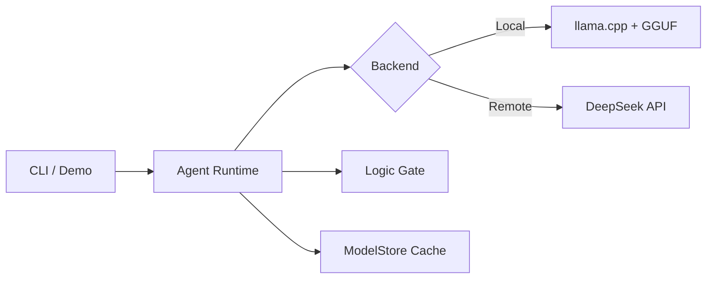

# CppDeepSeek

High-performance C++20 client for DeepSeek-R1 with reasoning separation, streaming, and a reusable `ModelStore` library for shared model locations.

**Quickstart (least friction)**
```bash
./b --deps
./b --demo
```
`demo.sh` requires CUDA by default. Use `DEMO_NO_CUDA=1` to run CPU-only. To offload with llama.cpp
on GPU (CUDA/Metal), set `DEMO_GPU_LAYERS` (e.g., `DEMO_GPU_LAYERS=20` or `DEMO_GPU_LAYERS=auto`).

**Architecture**


**WSL2 (CUDA)**
CUDA must be installed inside WSL2 (paths under `/mnt/c` do not work for Linux builds).

```bash
scripts/install_cuda_wsl.sh
./b --tests --cuda
```

**macOS (Metal)**
llama.cpp enables Metal on macOS by default. To force it on/off via the build helper:
```bash
./b --metal
./b --no-metal
```

**Build**
```bash
cmake -S . -B build
cmake --build build
```

**Install deps (Ubuntu/Debian)**
```bash
scripts/install_deps.sh
```

**Build app (default ON)**
```bash
cmake -S . -B build -DCPPDEEPSEEK_BUILD_APP=ON
cmake --build build
```

**Run (interactive CLI by default)**
```bash
./build/CppDeepSeek
```
Type a topic and press ENTER. Use `exit` to quit.
Note: the app pauses between agent responses and waits for ENTER.

**Run with DeepSeek API**
```bash
DEEPSEEK_API_KEY=your_key ./build/CppDeepSeek --remote
```

**CLI examples**
```bash
./build/CppDeepSeek --topic "Is C++ a good agent runtime?" --rounds 2
DEEPSEEK_API_KEY=your_key ./build/CppDeepSeek --remote --model deepseek-reasoner --no-stream
./build/CppDeepSeek --load agent_memory.json --save agent_memory.json
./build/CppDeepSeek --gpu-layers 20
./build/CppDeepSeek --gpu-layers auto
```
`--gpu-layers auto` uses a lightweight heuristic based on model file size and total system memory.
It is most reliable on macOS (unified memory); for discrete GPUs, set an explicit value.

**Local model path**
By default, the app expects:
`~/.local/share/deepseek/models/deepseek-r1/model.gguf`

**Default model download (medium/pro)**
The build script downloads **DeepSeek‑R1‑Distill‑Qwen‑14B GGUF** (Q4_K_M) unless you set `DEEPSEEK_MODEL_SKIP=1`. The file is about 9 GB, so plan disk/ram accordingly.

Override the model URL:
```bash
DEEPSEEK_MODEL_URL="https://example.com/model.gguf" ./b --deps
```

**llama.cpp dependency**
Provide llama.cpp as `third_party/llama.cpp`, pass `-DLLAMA_CPP_DIR=/path/to/llama.cpp`,
or let CMake fetch it (default).

**Environment**
- `DEEPSEEK_API_KEY`: API key for DeepSeek.
- `DEEPSEEK_MODEL_HOME`: Optional override for the global model store.
- `XDG_DATA_HOME`: Optional base for the default model store.

Default model store:
- `~/.local/share/deepseek/models`

**ModelStore (separate library)**
`modelstore/` is designed to be split into its own repository and consumed by multiple apps.  
See `modelstore/README.md` for build, test, and install details.

**Source Layout**
- `src/`: application source files
- `include/`: public app headers

**Ensure models via CMake**
See `modelstore/README.md`.

**Install ModelStore**
```bash
cmake -S modelstore -B build/modelstore -DBUILD_SHARED_LIBS=ON
cmake --build build/modelstore
cmake --install build/modelstore
```

Then in another project:
```cmake
find_package(ModelStore CONFIG REQUIRED)
target_link_libraries(your_target PRIVATE ModelStore::ModelStore)
```
