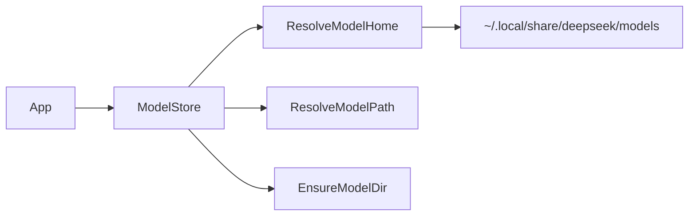

# ModelStore

Reusable model‑path and streaming utilities for DeepSeek projects. This folder is structured to be split into its own repository and consumed by multiple applications.

**Structure**


**Build**
```bash
cmake -S . -B build
cmake --build build
```

**Tests**
```bash
cmake -S . -B build
cmake --build build
ctest --test-dir build
```

**Ensure models via CMake**
```bash
cmake -S . -B build -DDEEPSEEK_MODELS="deepseek-r1;deepseek-v3"
cmake --build build --target ensure_models
```
Note: `ensure_models` runs once per build directory (stamp file). Delete `build/.ensure_models.stamp` to re-run.
To run automatically on every build, configure with `-DMODELSTORE_AUTO_ENSURE_MODELS=ON`.

**Ensure model directories (Python)**
```bash
python3 scripts/ensure_models.py --model deepseek-r1
```

**Install**
```bash
cmake -S . -B build -DBUILD_SHARED_LIBS=ON
cmake --build build
cmake --install build
```

Then in another project:
```cmake
find_package(ModelStore CONFIG REQUIRED)
target_link_libraries(your_target PRIVATE ModelStore::ModelStore)
```

**Environment**
- `DEEPSEEK_MODEL_HOME`: Optional override for the global model store.
- `XDG_DATA_HOME`: Optional base for the default model store.

Default model store:
- `~/.local/share/deepseek/models`
